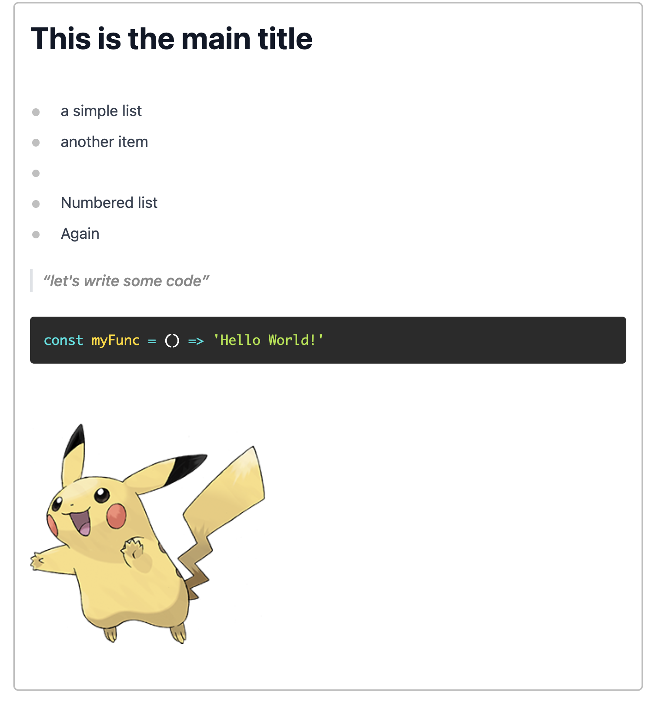

# wysiwyg-markdown-react

[Demo here](https://main--jazzy-wisp-f54aef.netlify.app)

```bash
npm i wysiwyg-markdown-react
pnpm add wysiwyg-markdown-react
yarn add wysiwyg-markdown-react
```



This is just [remirror](https://remirror.io) packed to work out of the box as WYSIWYG markdown editor to use with React.

```jsx
import { MarkdownEditor } from 'wysiwyg-markdown-react'
import "wysiwyg-markdown-react/dist/wysiwyg-markdown-react.css";
import "wysiwyg-markdown-react/dist/theme.css";

const MyComponent = () => {
  return (
    <MarkdownEditor
      initialContent={post.body}
      onChange={(text) => {
        setPost({ ...post, body: text })
      }}
    />
  )
}

```

Note that you need to import both the `wysiwyg-markdown-react.css` and `theme.css` files to apply the default styles to the editor. You can also copy the `theme.css` file [from here](/packages/markdown-editor/src/markdown-editor/theme.css) and customize it to fit your needs.
